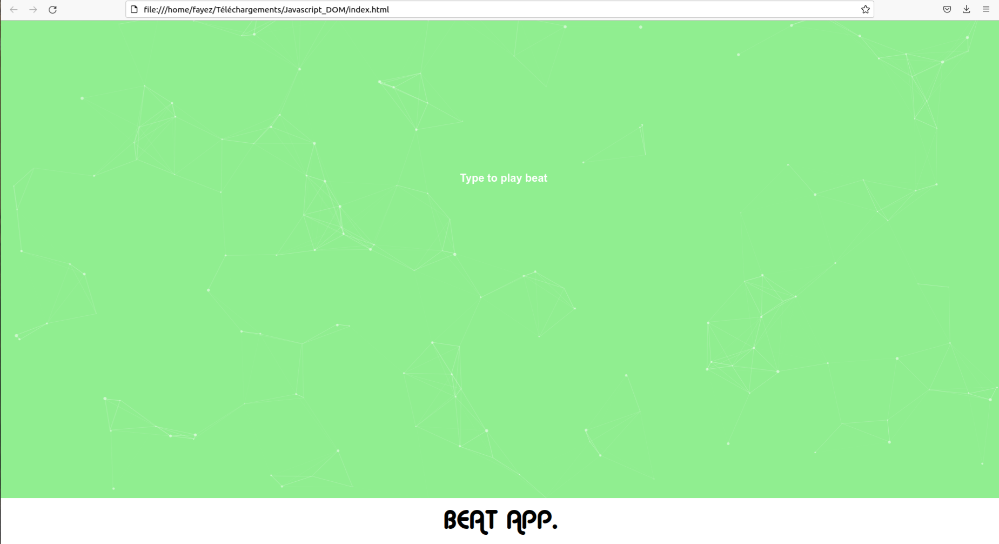
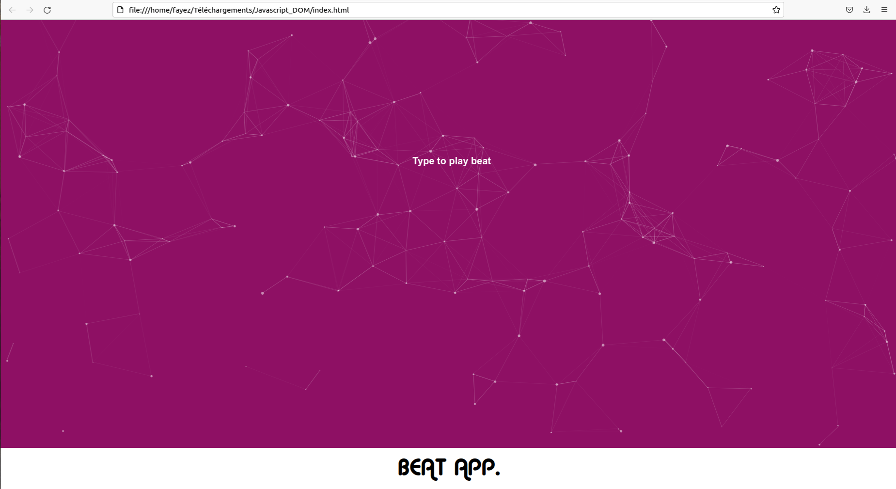

# DOM_js
Changing website background color and create sound by pressing letters using javascript  
Clicking on "a" or "e" or "z" or "d" it changes color and creates sound  
Clicking on the other keyboard letters only changes the color  

